# Azure Landing Zone Architecture

## Infrastructure Architecture Diagram

```mermaid
graph TB
    subgraph Internet["Internet"]
        Client["👥 External Users"]
    end

    subgraph Azure["Azure Landing Zone - iad-az-dev-rg"]
        subgraph Network["Virtual Network (10.0.0.0/16)"]
            subgraph AppGWSubnet["AppGW Subnet (10.0.0.0/24)"]
                AppGW["🚪 Application Gateway<br/>(Public IP)")
            end
            
            subgraph FrontendSubnet["Frontend Subnet (10.0.1.0/24)"]
                FE1["💻 Frontend VM-1<br/>(Standard_D2s_v3)"]
                FE2["💻 Frontend VM-2<br/>(Standard_D2s_v3)"]
            end
            
            subgraph BackendSubnet["Backend Subnet (10.0.2.0/24)"]
                BE1["⚙️ Backend VM-1<br/>(Standard_D2s_v3)"]
                BE2["⚙️ Backend VM-2<br/>(Standard_D2s_v3)"]
                LB["⚖️ Internal Load Balancer"]
            end
            
            subgraph DatabaseSubnet["Database Subnet (10.0.3.0/24)"]
                DB["🗄️ Database VM-1<br/>(Standard_D2s_v3)"]
            end
            
            subgraph BastionSubnet["Bastion Subnet (10.0.4.0/26)"]
                Bastion["🛡️ Azure Bastion<br/>(Secure Access)"]
            end
            
            subgraph KeyVaultSubnet["Key Vault"]
                KV["🔐 Azure Key Vault<br/>(Credentials Storage)"]
            end
        end
    end

    subgraph GitHub["GitHub - ashok-3209/az-infra-2026"]
        subgraph GitOps["CI/CD Pipeline"]
            FR["📝 Feature Branch<br/>terraform init<br/>terraform plan"]
            PR["✅ Pull Request<br/>Plan Review<br/>Approval Gate"]
            MAIN["🚀 Main Branch<br/>terraform apply"]
        end
        
        subgraph Auth["🔒 OIDC Auth"]
            AppReg["App Registration<br/>(github-svc01)"]
            Fed["Federated Creds<br/>(main, feature/*, fix/*)"]
        end
    end

    Client -->|HTTPS| AppGW
    AppGW -->|Route| FE1
    AppGW -->|Route| FE2
    FE1 -->|Internal| LB
    FE2 -->|Internal| LB
    LB -->|Connect| BE1
    LB -->|Connect| BE2
    BE1 -->|Query| DB
    BE2 -->|Query| DB
    Bastion -->|Manage| FE1
    Bastion -->|Manage| BE1
    Bastion -->|Manage| DB
    KV -->|Secrets| FE1
    KV -->|Secrets| BE1
    KV -->|Secrets| DB
    
    FR -->|Create| PR
    PR -->|Approved| MAIN
    AppReg -->|OIDC Token| FR
    AppReg -->|OIDC Token| MAIN
    Fed -->|Validate| AppReg

    style Azure fill:#0078d4,color:#fff,stroke:#333
    style Network fill:#50e6ff,color:#000
    style GitHub fill:#24292e,color:#fff
    style GitOps fill:#238636,color:#fff
    style Auth fill:#da3633,color:#fff
    style Internet fill:#f0ad4e,color:#000
```

## CI/CD Pipeline Flow

```mermaid
graph LR
    A["👨‍💻 Developer"] -->|Push/PR| B["📦 Feature Branch<br/>(feature/*, fix/*)"]
    B -->|Trigger| C["✓ Format Check<br/>✓ Syntax Validate"]
    C -->|Pass| D["📋 Terraform Plan<br/>(Dry Run)"]
    D -->|Generate| E["📄 Plan Results<br/>(Posted to PR)"]
    E -->|Review| F{"👀 Code Review<br/>Approved?"}
    F -->|No| G["❌ Blocked"]
    F -->|Yes| H["🔄 Merge to Main"]
    H -->|Trigger| I["🚀 Terraform Apply<br/>(Deploy)"]
    I -->|Success| J["✅ Infrastructure<br/>Updated"]
    
    style A fill:#0078d4,color:#fff
    style B fill:#238636,color:#fff
    style C fill:#1f6feb,color:#fff
    style D fill:#1f6feb,color:#fff
    style E fill:#1f6feb,color:#fff
    style F fill:#da3633,color:#fff
    style G fill:#da3633,color:#fff
    style H fill:#238636,color:#fff
    style I fill:#238636,color:#fff
    style J fill:#238636,color:#fff
```



## Security Architecture

```
┌─────────────────────────────────────────────────────────────┐
│                    GitHub Actions                           │
│                    ┌──────────────┐                         │
│        ┌──────────→│ OIDC Token   │◄──────────┐            │
│        │           └──────────────┘           │            │
│        │                                      │            │
│  ┌─────┴──────┐                        ┌─────┴──────┐    │
│  │ Feature BR │                        │ Main BR    │    │
│  │ Terraform  │                        │ Terraform  │    │
│  │ Plan       │                        │ Apply      │    │
│  └────────────┘                        └────────────┘    │
└─────────────────────────────────────────────────────────────┘
           │                                    │
           ↓                                    ↓
┌──────────────────────────────────────────────────────────────┐
│                   Azure AD                                   │
│        ┌────────────────────────────────┐                   │
│        │   App Registration             │                   │
│        │   (github-svc01)               │                   │
│        │   ┌──────────────────────────┐ │                   │
│        │   │ Federated Credentials:   │ │                   │
│        │   │ • main branch            │ │                   │
│        │   │ • feature/* branches     │ │                   │
│        │   │ • fix/* branches         │ │                   │
│        │   └──────────────────────────┘ │                   │
│        └────────────────────────────────┘                   │
│                     ↓                                       │
│        ┌────────────────────────────────┐                   │
│        │  Azure Subscription           │                   │
│        │  (Role: Contributor)          │                   │
│        └────────────────────────────────┘                   │
└─────────────────────────────────────────────────────────────┘
           │
           ↓
┌──────────────────────────────────────────────────────────────┐
│              Azure Infrastructure                            │
│    (VMs, Load Balancer, App Gateway, Key Vault, etc.)       │
└──────────────────────────────────────────────────────────────┘

✅ Zero Static Secrets
✅ OpenID Connect (OIDC) Authentication
✅ Federated Identity
✅ Secure & Scalable
```

## Deployment Checklist

- [x] 4 Virtual Machines (2 Frontend, 2 Backend, 1 Database)
- [x] Azure Load Balancer (Internal)
- [x] Application Gateway (External)
- [x] Virtual Network with 5 Subnets
- [x] Azure Bastion Host
- [x] Azure Key Vault
- [x] 8 Reusable Terraform Modules
- [x] GitHub Actions CI/CD Pipeline
- [x] OIDC Federated Credentials
- [x] Environment-based configurations (dev, prod)
